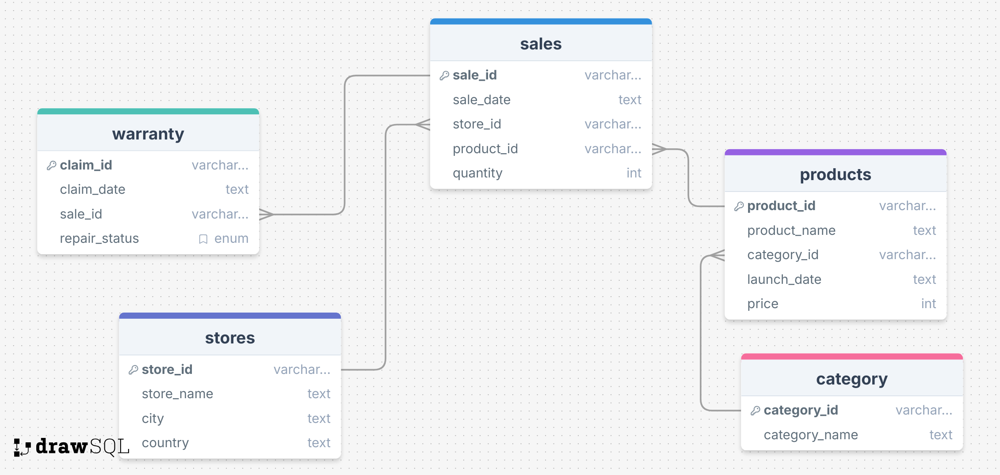

# Apple Retail Sales SQL Analysis

SQLite project analyzing over **1 million Apple retail sales records**.  
Focus: store performance, product demand, and warranty behavior using advanced SQL techniques.

---

## Database Schema

The project uses five main tables:

1. **stores**: Apple retail stores.
   - `store_id`: Unique identifier.
   - `store_name`: Name of the store.
   - `city`: City location.
   - `country`: Country of the store.

2. **category**: Product categories.
   - `category_id`: Unique identifier.
   - `category_name`: Category name.

3. **products**: Apple products.
   - `product_id`: Unique identifier.
   - `product_name`: Name of the product.
   - `category_id`: References category.
   - `launch_date`: Product launch date.
   - `price`: Price.

4. **sales**: Sales transactions.
   - `sale_id`: Unique identifier.
   - `sale_date`: Date of sale.
   - `store_id`: References stores.
   - `product_id`: References products.
   - `quantity`: Units sold.

5. **warranty**: Warranty claims.
   - `claim_id`: Unique identifier.
   - `claim_date`: Claim date.
   - `sale_id`: References sales.
   - `repair_status`: Status of the claim (e.g., Paid Repaired, Warranty Void).

---

## ER Diagram



*(Exported from [drawsql.app](https://drawsql.app/))*

---

## Objectives

### Easy to Medium (10 Questions)
1. Number of stores in each country  
2. Total units sold per store  
3. Sales in December 2023  
4. Stores with zero warranty claims  
5. Percentage of claims marked "Warranty Void"  
6. Highest units sold by store last year  
7. Count of unique products sold last year  
8. Average product price per category  
9. Warranty claims in 2020  
10. Best-selling day per store  

### Medium to Hard (5 Questions)
11. Least selling product per country per year  
12. Warranty claims within 180 days of sale  
13. Warranty claims for products launched in last two years  
14. Months in last 3 years with >5,000 units sold in USA  
15. Category with most warranty claims in last two years  

### Complex (5 Questions)
16. Percentage chance of warranty claims per country  
17. Year-over-year growth ratio per store  
18. Correlation of product price vs. warranty claims  
19. Store with highest % of "Paid Repaired" claims  
20. Monthly running total of sales per store over 4 years  

### Bonus
- Analyze sales trends by product lifecycle: 0-6, 6-12, 12-18, 18+ months  

---

## Project Focus
- Complex joins and aggregations  
- Window functions for running totals and growth  
- Time-based data segmentation  
- Correlation analysis  
- Real-world business problem solving  

---

## Dataset
- **Size**: 1M+ sales records  
- **Period**: Multiple years  
- **Coverage**: Multiple countries  

---

## How to Run

1. Open SQLite3 in your project folder:
```bash
sqlite3 apple.db
```

2. Create the database schema:
```sql
.read schema.sql
```

3. Import CSV data:
```sql
.import --csv --skip 1 category.csv category
.import --csv --skip 1 products.csv products
.import --csv --skip 1 sales.csv sales
.import --csv --skip 1 stores.csv stores
.import --csv --skip 1 warranty.csv warranty
```

4. Run all analysis queries:
```sql
.read queries.sql
```

---

## Tools
- SQLite3  
- VS Code 
- dbdiagram.io for schema visualization  
- Excel or Power BI for optional charting  

---

## Author
**Anvisha Dekate**  
SQL-based analytical study on Apple retail dataset. Demonstrates advanced querying skills, large dataset handling, and real-world business insights.

